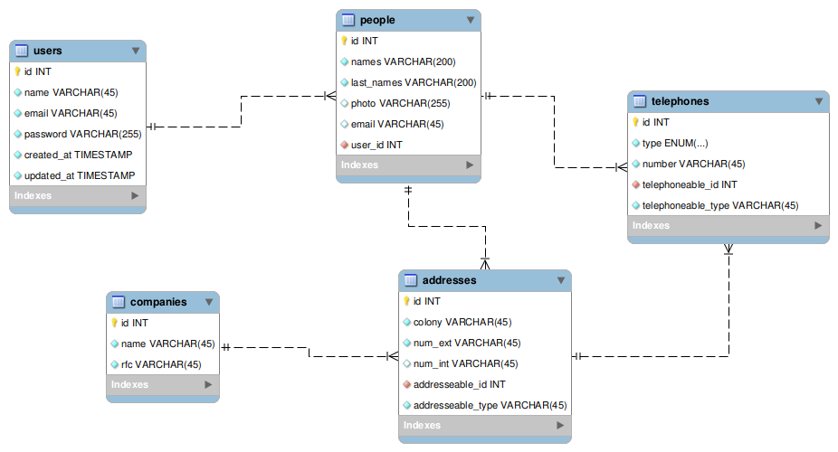

# Despliegue de teléfonos almacenados

Este repositorio es solo de practica básica de un CRUD

Las Herramientas usadas son las siguientes

* Mysql
* Mysql workbrench (Diagrama Base de datos)
* Php 7.0
* Laravel 5.4

