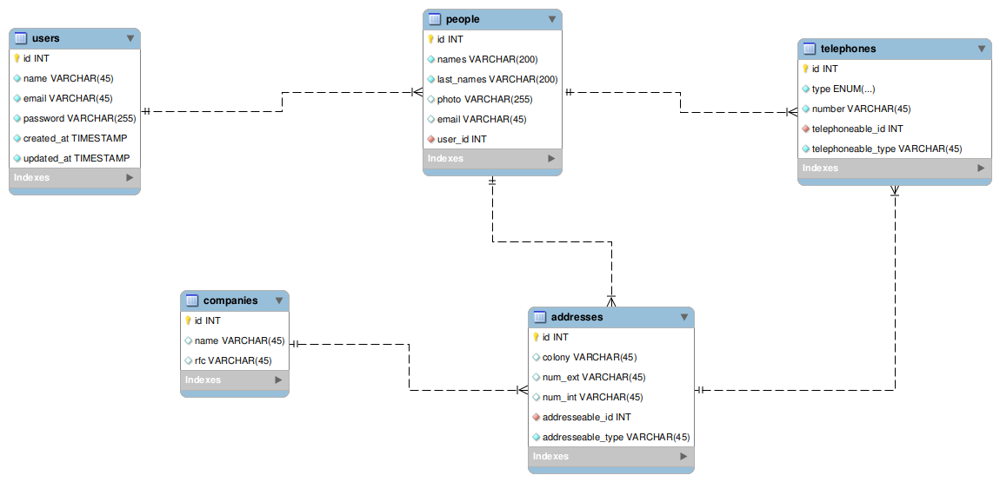

# Curd Básico de Laravel 5.4

Este repositorio es solo de practica basica de un CRUD

Las Herramientas usadas son las siguientes
* Mysql
* Mysql workbrench (Diagrama Base de datos)
* Php 7.0
* Laravel 5.4

